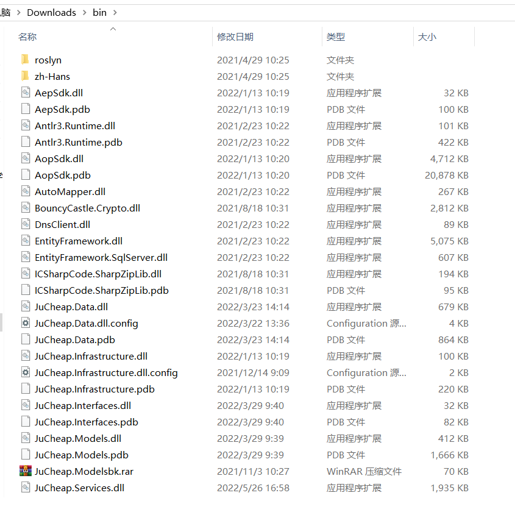

# Ankerui Electric Co., Ltd.'s prepaid cloud platform has an information leakage vulnerability

The website root backup file was leaked. After downloading, decompressed and decompiled. It was found that the JuCheap.Data.dll.config configuration file leaked the IP address of the intranet server and the database account password.

Below is a real case. Visit http://121.42.13.86:10315/bin.rar to download the source code compressed file. bin.rar has been placed in the current directory.

Decompress the bin.rar compressed package

The JuCheap.Data.dll.config configuration file leaks the intranet server IP address and database account password.

