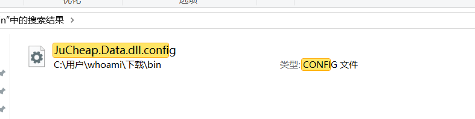
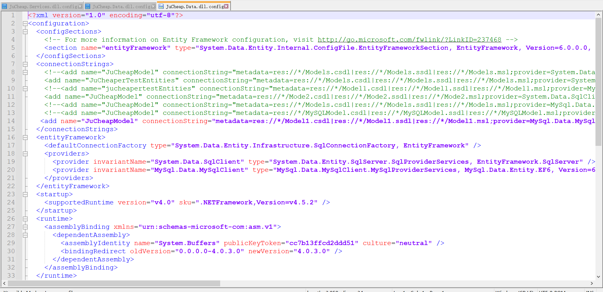
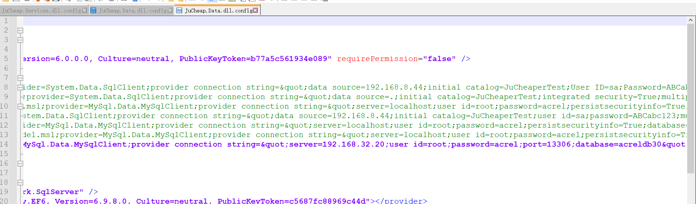

# Ankerui Electric Power Prepaid Cloud Platform Information Leakage Vulnerability

---

## 1. Basic information
- **Vulnerability ID**: [Assigned by CNA]
- **Vulnerability Type**: Information leakage/sensitive data leakage
- **Severity**: High (CVSS:3.1/AV:N/AC:L/PR:N/UI:N/S:U/C:H/I:H/A:H)
- **Seller**: Ankerui Electric Co., Ltd.
- **Product**: Prepaid Cloud Platform (Prepaid Cloud Platform)
- **Affected Versions**: Deploy all versions of public backup files (confirmed in JuCheap based deployments)
- **Disclosure Status**: Publicly disclosed via public backup files

---

## 2. Vulnerability description
Ankerui Electric Co., Ltd.'s prepaid cloud platform has an **Unauthorized Information Disclosure Vulnerability** (CWE-200: Exposure of Sensitive Information to an Unauthorized Actor). An attacker can access sensitive platform configuration data without authentication by downloading exposed source code backup files directly from the web root directory.

The leaked information includes:
- Intranet server IP address
- Database connection credentials (username and password)
- Other core system configuration parameters

This allows attackers to directly connect to the back-end business database, read/modify/delete key user data (such as payment records, account information), and further launch intranet penetration or lateral movement attacks, seriously endangering user data security and platform business continuity.

---

## 3. Proof of Concept (PoC)
### 3.1 Vulnerability Exploitation Steps
1. An attacker can download the exposed source code backup file from the following location: 
```` 
http://121.42.13.86:10315/bin.rar 
````
2. Unzip the "bin.rar" compressed package to obtain the complete application source code and configuration files.
3. Find the "JuCheap.Data.dll.config" file in the decompression directory.
4. Open the file to view **clear text** sensitive configuration data: 
- Intranet server IP address 
- Database server address 
- Database username and password

### 3.2 Evidence screenshots
- Unzip "bin.rar" to confirm that the complete source code is disclosed: 

- `JuCheap.Data.dll.config` leaks the intranet server IP: 

- `JuCheap.Data.dll.config` leaks database account credentials: 
 


---

## 4. Impact analysis
- **Data Breach**: Unauthorized access to user payment records, account information, and other sensitive business data.
- **Database Compromise**: Direct access to the backend database allows complete read/write/delete operations on critical business data.
- **Intranet Exposed**: Exposed intranet IPs and credentials provide a foothold for further attacks against internal network infrastructure.
- **Business Interruption**: Tampering or deletion of core data may result in service interruption and financial losses to users and suppliers.

---

## 5. Technical details
- **Root Cause**: The platform's web root contains unprotected source code backup files (e.g. "bin.rar") that are publicly accessible without authentication.
- **Sensitive Data Storage**: Core configuration files like "JuCheap.Data.dll.config" store database credentials and intranet IPs in **clear text** without encryption or obfuscation.
- **Attack Vector**: Remote, unauthenticated HTTP request to download a backup file, followed by local decompression and configuration parsing.
- **Attack Complexity**: Low (no special tools or permissions required; standard HTTP client and archiving utility are sufficient).

---

## 6. Remedial suggestions
1. **Take action now**: 
- Remove all exposed backup files (e.g. `bin.rar`, `*.bak`, `*.zip`) from the web root directory.
- Immediately rotate all compromised database credentials.
- Restrict database access to trusted IP ranges only.
2. **Long term fix**: 
- Implement strict access control rules to prevent public access to backups and configuration files.
- Encrypt or protect sensitive configuration data (for example, using environment variables or secure configuration libraries).
- Conduct regular security audits to identify and remove exposed sensitive files.
- Establish safe deployment practices to avoid leaving backup files in the production web directory.